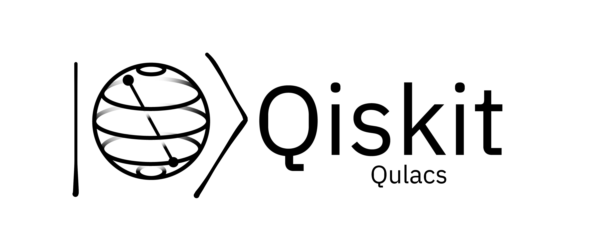

<!-- 
 -->

Qiskit-Qulacs allows user to execute Qiskit programs using Qulacs backend.

**Qiskit-Qulacs is actively being developed, and we welcome your input and suggestions on the API and use-cases. If you have any ideas or feedback, please feel free to open a GitHub issue or contact us. We are interested in hearing about your experiences using the library.**

1.  [About](docs/project_overview.md)
2.  [Beginner's Guide](docs/beginners_guide.md)
3.  [Installation](INSTALL.md)
4.  [Quickstart Guide](docs/quickstart_guide.md)
5.  [Tutorials](docs/tutorials/)
6.  [How-Tos](docs/how_tos/)
8.  [How to Give Feedback](#how-to-give-feedback)
9.  [Contribution Guidelines](#contribution-guidelines)
10. [References and Acknowledgements](#references-and-acknowledgements)
11. [License](#license)

##### For Developers/Contributors

1. [Contribution Guide](CONTRIBUTING.md)
2. [Technical Docs](docs/technical_docs.md)

----------------------------------------------------------------------------------------------------

### How to Give Feedback

We encourage your feedback! You can share your thoughts with us by:
- [Opening an issue](https://github.com/Gopal-Dahale/qiskit-qulacs/issues) in the repository

----------------------------------------------------------------------------------------------------

### Contribution Guidelines

For information on how to contribute to this project, please take a look at our [contribution guidelines](CONTRIBUTING.md).

----------------------------------------------------------------------------------------------------

## References and Acknowledgements
[1] Qiskit https://qiskit.org/ \
[2] Qiskit-terra https://github.com/Qiskit/qiskit-terra \
[3] Qulacs https://github.com/qulacs/qulacs

----------------------------------------------------------------------------------------------------

### License
[Apache License 2.0](LICENSE.txt)