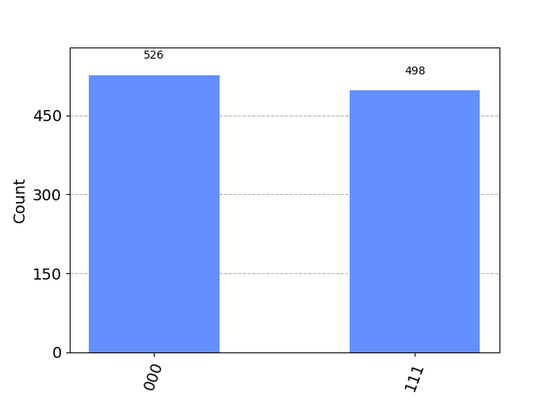

# Beginner's Guide

Welcome to the Qiskit-Qulacs Beginner's Guide! This guide is designed to provide new users with an overview of the Qiskit-Qulacs project and its capabilities. It will walk you through the installation process, introduce you to the basics of the API, and provide an example problem to solve using the software.

## About the Project

Qiskit-Qulacs is a plugin for Qiskit that integrates the Qulacs library as a backend. The project aims to provide users with a powerful tool for quantum computing simulations and algorithm development. By leveraging [Qulacs'](https://github.com/qulacs/qulacs#performance) high-performance quantum circuit simulator, users can explore and experiment with various quantum computing concepts and algorithms.

## Installation

For detailed installation instructions, read the [Installation Guide](INSTALL.md).

## Usage

Once installed, you can use Qiskit-Qulacs through the Qiskit API. Here are some key points to understand:

1. You can access Qulacs Backend through `QualcsProvider` class and can perform statevector simulations.
2. For machine learning application, we can created a `QualcsEstimator` class along with `QulacsEstimatorGradient` for efficient forward and backward passes.


## Example Problem

To demonstrate the usage of Qiskit-Qulacs, let's solve a simple example problem: creating a 3 qubit GHZ state.

```python
import matplotlib.pyplot as plt
from qiskit import QuantumCircuit
from qiskit.visualization import plot_histogram

from qiskit_qulacs import QulacsProvider

# Create a bell state
qc = QuantumCircuit(3)
qc.h(0)
qc.cx(0, 1)
qc.cx(0, 2)

# Use Qiskit-Qulacs to run the circuit
backend = QulacsProvider().get_backend("qulacs_simulator")
result = backend.run(qc, shots=1024, seed_simulator=42).result()
counts = result.get_counts()

# Visualization
plot_histogram(counts)
plt.show()
```

Output:



## Conclusion

Congratulations! You have completed the Qiskit-Qulacs Beginner's Guide. You should now have a basic understanding of the project, how to install it, and how to use the Qiskit-Qulacs API. Feel free to explore more advanced features and experiment with different quantum circuits and algorithms. Happy quantum computing!
