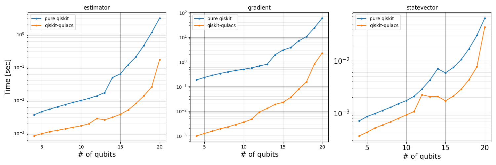
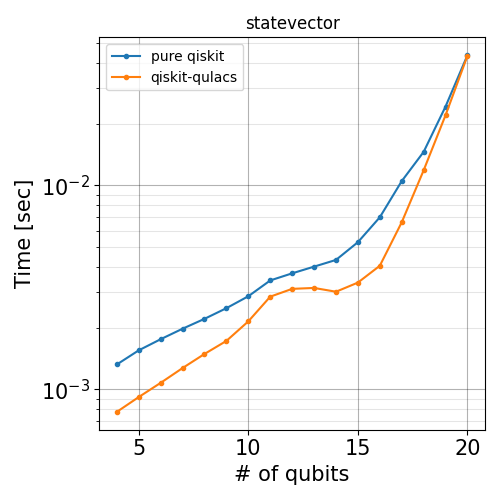

# Project Overview

## Background

The Qiskit-Qulacs project aims to bridge the gap between Qiskit and Qulacs by providing a plugin that allows Qulacs to be used as a backend for Qiskit, expanding the capabilities and flexibility of quantum computing simulations and experiments.

## Performance

Below plots are rough benchmarks. The code can be found in the `benchmarks` directory.

### CPU

### GPU

