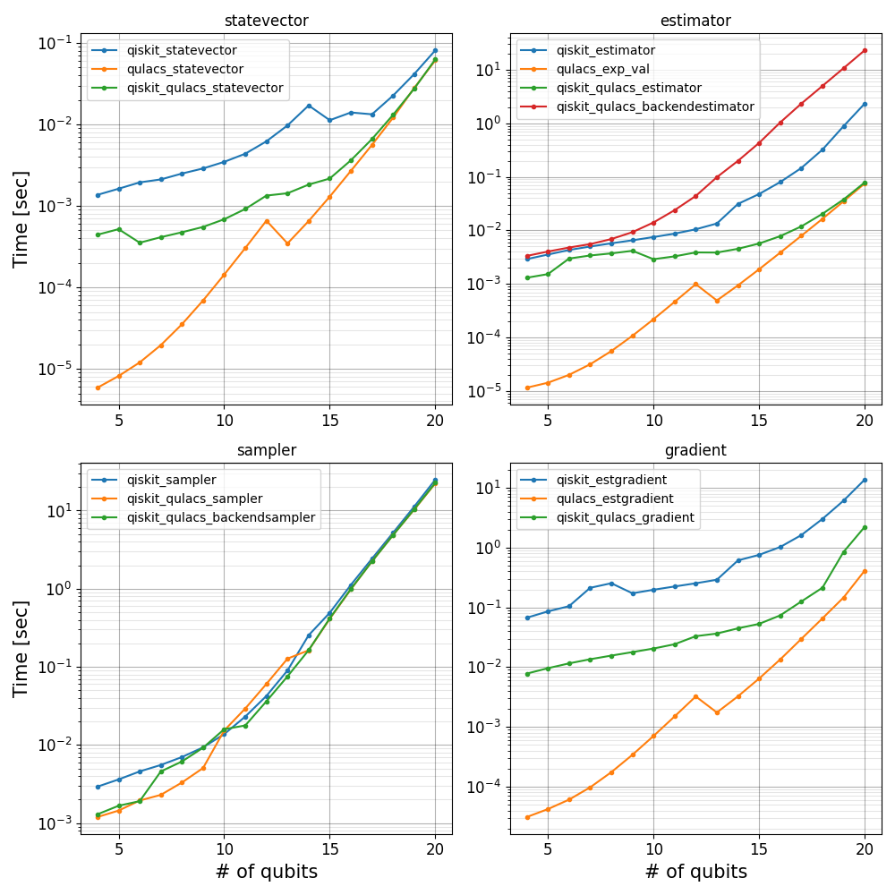

# Overview

## Background

The Qiskit-Qulacs project aims to bridge the gap between Qiskit and Qulacs by providing a plugin that allows Qulacs to be used as a backend for Qiskit, expanding the capabilities and flexibility of quantum computing simulations and experiments.

## Performance

Below plots are rough benchmarks. The code can be found in the [benchmarks](https://github.com/Gopal-Dahale/qiskit-qulacs/tree/main/benchmarks) directory.

### CPU

### GPU

## Limitations

- Only selected gates support trainable parameters. Not supported for gates like U1, U2, U3 etc.
- For parameter expression with qulacs we use sympy to perform differentiation of the expression which will be evaluated at the given parameter value. This will be multiplied by the gradients obtained by qulacs. Currently, only single variable expressions are supported i.e. `x^2 + 3x` and not `x^2 + 4y` during the gradient computation.
- The gradient computation does not yet support circuits which use the same parameters more than once in different gates. It will not raise any error but the results obtained are incorrect.
- Support for Parameterized SparsePauliOp is not present.
- In `QulacsBackend`, if more than one circuit is passed to the `run` method, the `get_statevector` method on the result object will raise an error. The alternative is to iterate over the result object.